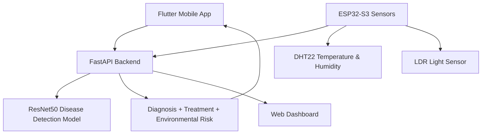
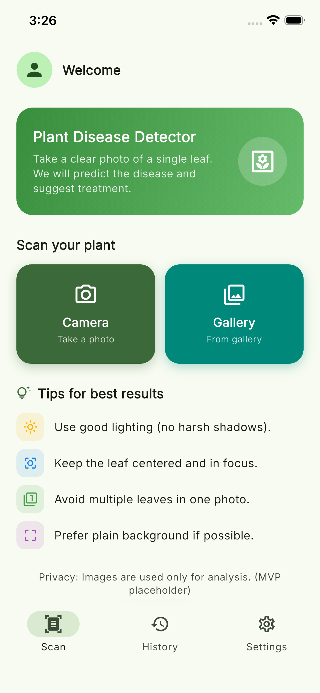
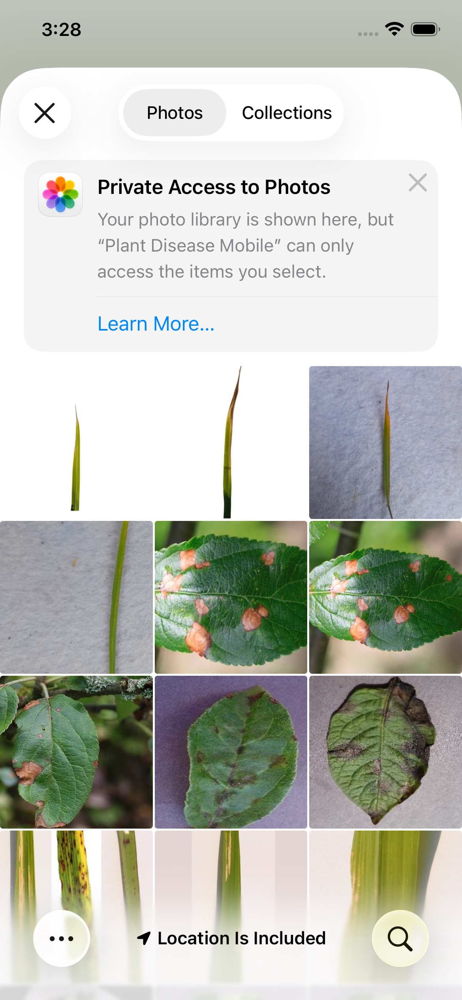
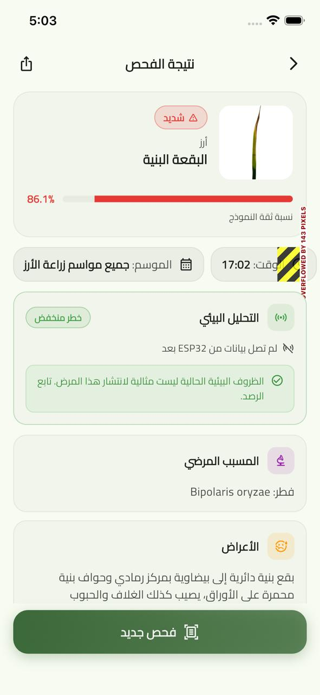
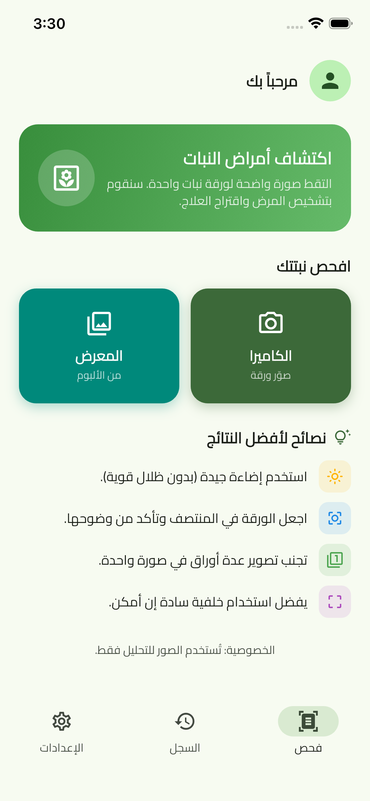
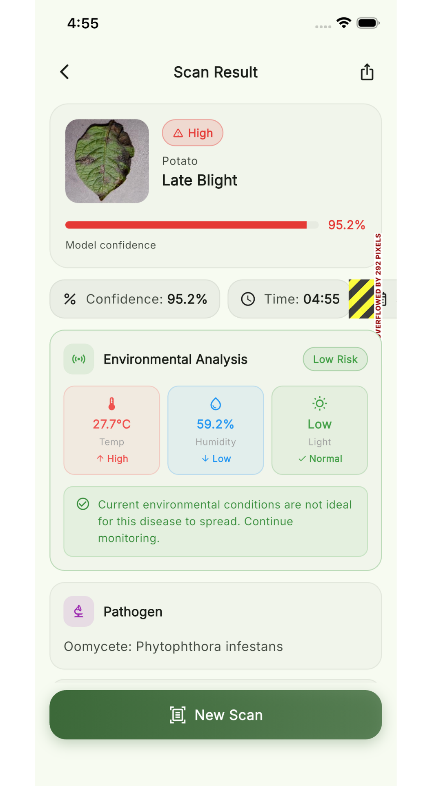
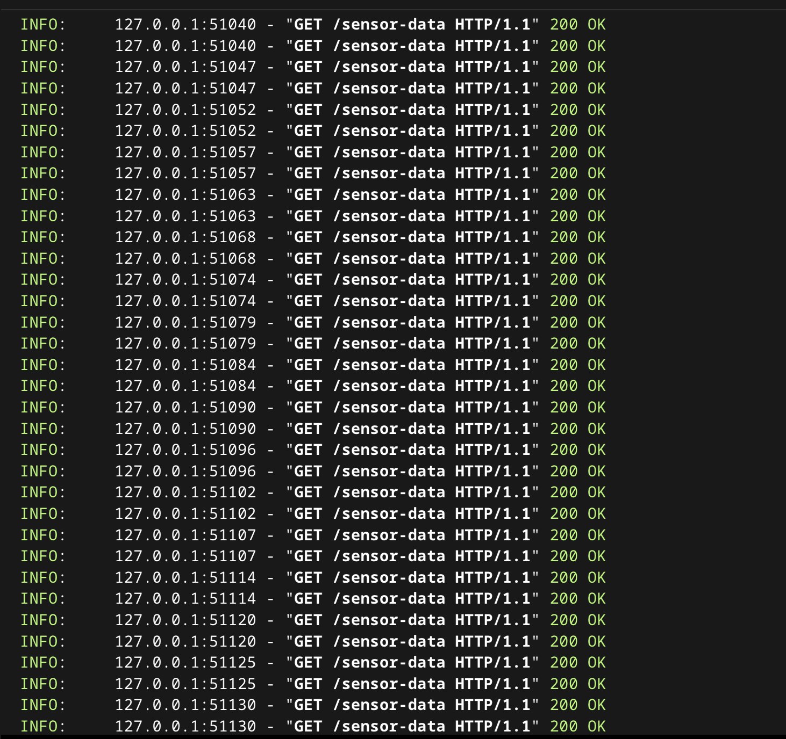

<div align="center">

# 🌿 AI Plant Disease Diagnosis System

**An end-to-end AI + IoT graduation project**
Misr University for Science and Technology (MUST) · Supervisor: Dr. Heba ELnemr · 2026


</div>

> **AI-powered plant disease diagnosis system combining computer vision, mobile
> app development, backend APIs, and IoT environmental monitoring.** The system
> detects plant leaf diseases using a fine-tuned ResNet50 model, rejects
> non-plant images, provides bilingual Arabic/English guidance, and monitors
> environmental conditions using ESP32 sensors.

---

## 📋 Overview

This project is a complete **agricultural decision-support system**, not just an
image classifier. A user photographs a plant leaf; the system classifies the
disease with a fine-tuned **ResNet50** model, cross-references a bilingual
knowledge base for symptoms and treatment, and combines the result with live
environmental readings (temperature, humidity, light) from **ESP32 sensors** to
assess whether the surrounding conditions are accelerating the disease — all
delivered through a cross-platform **Flutter** app in **Arabic and English**.

## ❓ Problem Statement

Plant diseases cause major crop losses, and early detection is difficult for
non-experts. Existing tools usually stop at classification: they name a disease
but give no treatment guidance, ignore environmental drivers of disease spread,
blindly guess on non-plant images, and are rarely accessible to Arabic-speaking
farmers.

## 💡 Solution

An integrated pipeline that goes from a single leaf photo to actionable advice:

1. **Detect** the disease from the leaf image (ResNet50, 99.61% test accuracy).
2. **Reject** non-plant images with a dedicated `Not_plant` class.
3. **Explain** symptoms, treatment, and prevention from a bilingual knowledge base.
4. **Contextualize** the diagnosis with real-time environmental risk analysis from IoT sensors.
5. **Deliver** everything in a clean, bilingual mobile experience.

---

## ✨ Key Features

- 🔬 **Plant disease classification** from leaf images (43 classes).
- 🛡️ **Non-plant image rejection** via a dedicated `Not_plant` class.
- 🌍 **Bilingual Arabic/English** diagnosis and treatment guidance.
- 📱 **Flutter mobile app** for Android, iOS, Web, and Desktop.
- ⚡ **FastAPI backend** serving real-time model inference.
- 📡 **ESP32-S3 sensor integration** over WiFi (HTTP POST).
- 🌡️ **DHT22** temperature & humidity monitoring.
- 💡 **LDR** ambient light monitoring.
- 🧠 **Environmental risk analysis** that links conditions to disease spread.
- 🖼️ **User-friendly result preview** with confidence and top-3 predictions.
- 🕓 **Diagnosis history tracking** of previous scans.
- 🌗 **Light / dark mode** support.
- 🧩 **Modular project structure** (backend · mobile · hardware · ml · web).

---

## 🏗️ System Architecture

The mobile app sends a leaf image to the FastAPI backend, which runs the ResNet50
model and enriches the prediction with the latest ESP32 sensor readings before
returning a full diagnosis.



---

## 🛠️ Tech Stack

**Machine Learning**
- Python · PyTorch · Torchvision
- ResNet50 (Transfer Learning, fine-tuned)
- Image preprocessing & augmentation · Test-Time Augmentation (TTA)

**Backend**
- FastAPI · REST API · JSON responses · Uvicorn

**Mobile**
- Flutter · Dart
- Arabic / English UI (localization) · Light / Dark mode
- Firebase Auth · provider · image_picker · google_fonts · share_plus

**IoT**
- ESP32-S3 · DHT22 (temperature/humidity) · LDR (light)
- HTTP POST sensor updates over WiFi

**Tools**
- GitHub · Google Colab / Jupyter · VS Code · Android Studio

---

## 📊 Dataset Summary

| Property | Value |
|---|---|
| Total images | **77,809** |
| Classes | **43** (42 plant: 38 PlantVillage + 4 Rice) + `Not_plant` |
| Sources | PlantVillage + RiceLeafs_merged_224 (+ curated non-plant images) |
| Split | 80% train / 20% held-out test (~62,247 / ~15,562) |
| Class balancing | 1,200 images per class → 51,600 per training fold |
| Image size | 224 × 224 px |

## 🧠 Model Training Summary

- **Architecture:** ResNet50 pretrained on ImageNet (`IMAGENET1K_V2`), fully fine-tuned, final layer `Linear(2048 → 43)`.
- **Strategy:** Transfer learning · 5-Fold Cross-Validation · Early Stopping · Test-Time Augmentation.
- **Optimizer:** AdamW (lr 1e-4, weight decay 1e-4) · **Scheduler:** CosineAnnealingLR.
- **Loss:** CrossEntropyLoss (label smoothing 0.05) · **Batch:** 32 · **Max epochs:** 30 · **Seed:** 42.
- **Augmentation:** random crop/flip/rotation, color jitter, perspective, Gaussian blur, random erasing — to simulate real mobile-camera conditions.

Full details → [`docs/training_details.md`](docs/training_details.md)

## 🏆 Results

| Metric | Value |
|---|---|
| **Test Accuracy** | **99.61%** |
| Test Precision (macro) | 99.53% |
| Test Recall (macro) | 99.54% |
| Test F1-Score (macro) | 99.53% |
| Best fold (Fold 4) validation | 99.37% |
| Mean CV accuracy | 99.26% ± 0.13% |

> Test accuracy (99.61%) is measured on **15,562 held-out images the model never
> saw during training**, and is *higher* than validation accuracy (99.37%) — a
> strong indicator the model generalizes well and is not overfitting.

---

## 📱 Mobile App

A single Flutter codebase targeting **Android, iOS, Web, and Desktop**. Key
screens: splash, authentication, home/capture, image preview, diagnosis result
(with confidence and top-3), history, history detail, and settings. Features
bilingual Arabic/English localization, light/dark themes, Firebase
authentication, and local scan history.

## 🔌 Backend API

FastAPI service that loads the ResNet50 checkpoint and exposes:

| Method | Endpoint | Description |
|---|---|---|
| `GET` | `/` | Health check |
| `POST` | `/predict` | Leaf image → disease + confidence + top-3 + environmental analysis |
| `POST` | `/sensor-data` | ESP32 pushes temperature, humidity, light |
| `GET` | `/sensor-data` | Latest sensor reading |

<details>
<summary><b>Example <code>/predict</code> response</b></summary>

```json
{
  "class_id": 34,
  "disease": "Tomato___Early_blight",
  "is_plant": true,
  "confidence": 0.9741,
  "top3": [ { "disease": "...", "confidence": 0.97 } ],
  "sensor_data": { "temperature": 28.5, "humidity": 65, "light": 1850 },
  "env_analysis": {
    "environmental_risk": "high",
    "summary_en": "Current environment is contributing to disease spread.",
    "improvement_tips_en": [ "..." ]
  }
}
```
</details>

## 📡 IoT Hardware Integration

An **ESP32-S3** board reads a **DHT22** (temperature & humidity) and an **LDR**
(light intensity), then pushes readings to the backend via `POST /sensor-data`
over WiFi. During a prediction, the backend merges the latest reading with the
disease result to produce an environmental risk assessment and improvement tips.
Firmware: [`hardware/esp32_sensor_sender/`](hardware/esp32_sensor_sender/) ·
Wiring guide: [`docs/plant_hardware_setup.md`](docs/plant_hardware_setup.md).

---
## 📸 Screenshots

| Home | Upload | Result |
|---|---|---|
|  |  |  |

| Arabic Guidance | Sensor Dashboard | API Response |
|---|---|---|
|  |  |  |


---

## 📂 Repository Structure

```
plant-disease-ai/
├── backend/          # FastAPI backend and model inference API
├── mobile_app/       # Flutter mobile application (Android · iOS · Web · Desktop)
├── hardware/         # ESP32-S3 sensor firmware (DHT22 + LDR)
├── ml/               # Training notebooks and utility scripts
├── models/           # Model weights location + download instructions
├── web/              # Standalone web dashboard
├── data/             # Bilingual disease knowledge base (symptoms, treatment)
├── docs/             # Documentation, reports, and screenshots
├── assets/           # Team photos and shared images
└── README.md
```

---

## ▶️ How to Run

### 1 — Backend (AI server)

```bash
python3 -m venv venv
source venv/bin/activate          # Windows: venv\Scripts\activate
pip install -r backend/requirements.txt
cd backend
uvicorn app:app --host 0.0.0.0 --port 8000 --reload
```

Check `http://localhost:8000` → `{ "message": "Plant Disease API is running" }`

### 2 — Mobile app

```bash
cd mobile_app
flutter pub get
flutter run
```

Set your server IP in `mobile_app/lib/data/api_config.dart` when testing on a
physical device.

> **Firebase:** the app uses Firebase Auth. Config files (`google-services.json`,
> `GoogleService-Info.plist`, `firebase_options.dart`) are **not committed** for
> security — add your own from the [Firebase Console](https://console.firebase.google.com/)
> or run `flutterfire configure`.

### 3 — Hardware (ESP32)

Flash `hardware/esp32_sensor_sender/esp32_sensor_sender.ino` to the ESP32-S3 and
set your WiFi credentials and backend URL. See
[`docs/plant_hardware_setup.md`](docs/plant_hardware_setup.md).

---

## 📦 Model Weights

The trained weights (~91 MB) are **not** stored in the repository to keep it
lightweight. Download the model and place it at:

```
models/resnet50_43_FINAL_best.pth
```

The backend (`backend/app.py`) loads the checkpoint from this exact path. Full
instructions and the download link are in [`models/README.md`](models/README.md).

---

## 🚀 Future Improvements

- Deploy the backend online (e.g. Render / Railway / a cloud VM).
- Add a real-time sensor dashboard with historical charts.
- Expand to more plant species and disease classes.
- Improve treatment-recommendation quality with expert-reviewed content.
- Add user accounts and cloud-synced diagnosis history.
- Convert the model to a mobile-friendly format (TorchScript / TFLite / ONNX) for on-device inference.
- Add CI and automated testing (backend + Flutter).

---

## 👤 Author

**Yousef Ellawah** — [github.com/Y-LA](https://github.com/Y-LA)

**Team:** Yousef Ellawah · Omar Walid · Mohamed Emad · Nour Mohamed · Menna Mohamed · Ahmed Abdul-Wahab
**Supervisor:** Dr. Heba ELnemr — Misr University for Science and Technology (MUST), 2026

## 📄 License

Released under the [MIT License](LICENSE) — for educational and research purposes.
