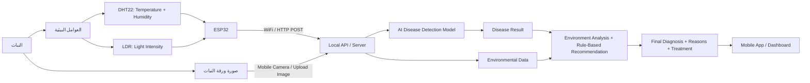

# Plant Disease AI + IoT System — Hardware, API, and Recommendation Logic

## 1) الفكرة النهائية للمشروع

المشروع أصبح عبارة عن **نظام ذكي لمتابعة النبات وتشخيص أمراضه**، وليس مجرد موديل AI يحلل صورة فقط.

النظام يجمع بين:

1. **AI Model** يحلل صورة ورقة النبات ويحدد المرض.
2. **ESP32 + Sensors** يقرأ العوامل البيئية حول النبات.
3. **API / Server** يدمج نتيجة الموديل مع بيانات الحساسات.
4. **Recommendation Engine** يطلع سبب محتمل وتوصيات علاجية مناسبة.
5. **Mobile App / Dashboard** يعرض النتيجة للمستخدم.

---

## 2) الأدوات المستخدمة في الهاردوير

| الجزء | القطعة | وظيفتها |
|---|---|---|
| Controller | ESP32 NodeMCU-32S / ESP-32S Kit | قراءة الحساسات وإرسال البيانات عبر WiFi |
| Temperature & Humidity | DHT22 Module | قياس درجة الحرارة والرطوبة |
| Light Sensor | LDR Module 4 Pins | قياس شدة الإضاءة بشكل تناظري Analog |
| Wiring | Breadboard + Jumper Wires | تنظيم التوصيل وتوزيع الكهرباء |
| Power | USB Cable from Laptop / Adapter | تشغيل ESP32 ورفع الكود |

> ملاحظة: البورد ظهر فعليًا في Arduino IDE كـ **ESP32-D0WD-V3**، لذلك الاختيار الصحيح في Arduino IDE هو **ESP32 Dev Module** وليس ESP32S3.

---

## 3) التوصيل النهائي على Breadboard

### توزيع الكهرباء

| من ESP32 | إلى Breadboard |
|---|---|
| 3V3 | خط + |
| GND | خط - |

### توصيل DHT22 Module

الحساس عندك 3 Pins مكتوب عليهم:

```text
GND  VCC  DAT
```

| DHT22 | ESP32 / Breadboard |
|---|---|
| VCC | 3V3 أو خط + |
| GND | GND أو خط - |
| DAT | P4 / GPIO4 |

### توصيل LDR Module 4 Pins

غالبًا مكتوب عليه:

```text
VCC  GND  DO  AO
```

استخدم **AO** فقط، وسيب **DO** فاضي.

| LDR Module | ESP32 / Breadboard |
|---|---|
| VCC | 3V3 أو خط + |
| GND | GND أو خط - |
| AO | P34 / GPIO34 |
| DO | لا يتم توصيله |

---

## 4) مخطط الربط العام Hardware + AI + API



---

## 5) شكل البيانات الخارجة من ESP32

بعد تشغيل DHT22 و LDR وصلنا لقراءات مثل:

```text
Temp: 26.00 °C | Hum: 56.90 % | Light: 3801
```

لكن LDR كان يعطي قراءة معكوسة:

- الظلمة = رقم عالي
- الإضاءة = رقم أقل

لذلك تم تعديل القراءة في الكود بحيث تصبح:

```text
Dark = Low Value
Strong Light = High Value
```

عن طريق:

```cpp
int fixedLight = 4095 - rawLight;
```

ثم تحويلها لنسبة مئوية:

```cpp
int lightPercent = map(rawLight, 4095, 0, 0, 100);
```

---

## 6) كود Arduino الحالي: DHT22 + LDR

```cpp
#include "DHT.h"

#define DHTPIN 4
#define DHTTYPE DHT22
#define LDR_PIN 34

DHT dht(DHTPIN, DHTTYPE);

void setup() {
  Serial.begin(19200);
  dht.begin();
}

void loop() {
  float temp = dht.readTemperature();
  float hum = dht.readHumidity();

  int rawLight = analogRead(LDR_PIN);

  // تعديل القراءة: نخلي الظلمة قليلة والنور عالي
  int fixedLight = 4095 - rawLight;

  // تحويلها لنسبة من 0 إلى 100
  int lightPercent = map(rawLight, 4095, 0, 0, 100);
  lightPercent = constrain(lightPercent, 0, 100);

  if (isnan(temp) || isnan(hum)) {
    Serial.println("DHT Error");
  } else {
    Serial.print("Temp: ");
    Serial.print(temp);
    Serial.print(" °C | Hum: ");
    Serial.print(hum);
    Serial.print(" % | Raw Light: ");
    Serial.print(rawLight);
    Serial.print(" | Fixed Light: ");
    Serial.print(fixedLight);
    Serial.print(" | Light: ");
    Serial.print(lightPercent);
    Serial.println("%");
  }

  delay(2000);
}
```

---

## 7) شكل الـ API المطلوب لاحقًا

### Endpoint 1: استقبال بيانات الحساسات

```http
POST /sensor-data
```

Body:

```json
{
  "device_id": "ESP32_001",
  "temperature": 26.0,
  "humidity": 56.9,
  "light_raw": 3801,
  "light_fixed": 294,
  "light_percent": 7,
  "timestamp": "2026-05-01T14:30:00"
}
```

### Endpoint 2: رفع صورة النبات

```http
POST /predict-image
```

Input:

```text
image: JPEG/PNG
```

Output مبدئي من الموديل:

```json
{
  "class_name": "Apple___Black_rot",
  "crop": "Apple",
  "disease": "Black Rot",
  "confidence": 0.94
}
```

### Endpoint 3: النتيجة النهائية

```http
GET /final-result
```

Output:

```json
{
  "plant": "Apple",
  "disease": "Black Rot",
  "confidence": 0.94,
  "environment": {
    "temperature": 38.2,
    "humidity": 75.1,
    "light_percent": 20
  },
  "possible_reasons": [
    "High temperature may increase plant stress.",
    "High humidity can support fungal disease spread."
  ],
  "recommendations": [
    "Improve ventilation.",
    "Reduce leaf wetness and avoid spraying water on leaves.",
    "Remove infected leaves or dead wood.",
    "Expose the plant to better suitable light gradually."
  ]
}
```

---

## 8) دور ملف الأمراض diseases_database.csv

الملف الذي تم رفعه يحتوي على قاعدة معرفة للأمراض، وعدد الصفوف الحالي:

- **42 classes**
- **29 diseased classes**
- **13 healthy classes**
- **15 crop types**

### أهم الأعمدة الموجودة في الملف

| العمود | الاستخدام داخل النظام |
|---|---|
| class_id | رقم الكلاس في الموديل |
| class_name | اسم الكلاس النهائي الخارج من الموديل |
| crop_en / crop_ar | اسم النبات عربي وإنجليزي |
| disease_en / disease_ar | اسم المرض عربي وإنجليزي |
| status | هل الحالة diseased أم healthy |
| pathogen_en / pathogen_ar | المسبب المرضي |
| symptoms_en / symptoms_ar | الأعراض |
| environmental_factors_en / environmental_factors_ar | الظروف البيئية المرتبطة بالمرض |
| predisposing_stress_en / predisposing_stress_ar | عوامل الإجهاد التي تساعد على المرض |
| chemical_treatment_en / chemical_treatment_ar | العلاج الكيميائي |
| organic_treatment_en / organic_treatment_ar | العلاج العضوي |
| prevention_en / prevention_ar | الوقاية |
| severity | شدة المرض |
| season_en / season_ar | الموسم الأكثر ارتباطًا بالمرض |
| source_url | مصدر المعلومة |

---

## 9) طريقة الدمج بين AI + Sensors + Disease Database

### الفكرة الأساسية

الموديل يطلع `class_name`، مثل:

```text
Apple___Black_rot
```

بعدها السيرفر يبحث في ملف الأمراض عن نفس `class_name` ويجلب بيانات المرض:

- اسم النبات
- اسم المرض
- المسبب
- الأعراض
- الظروف البيئية
- العلاج
- الوقاية

ثم يقارن بيانات الحساسات الحالية مع الظروف البيئية المكتوبة في قاعدة البيانات.

### مثال منطقي

لو الموديل قال:

```text
Apple___Black_rot
```

وقراءات الحساسات:

```text
Temperature = 38°C
Humidity = 75%
Light = 20%
```

والملف يقول إن المرض مرتبط بـ:

```text
Warm, humid summers
```

النظام يطلع:

```text
تم اكتشاف مرض العفن الأسود في التفاح.
الظروف الحالية قد تساعد على انتشار المرض بسبب ارتفاع الحرارة والرطوبة.
التوصية: تحسين التهوية، تقليل الرطوبة، إزالة الأجزاء المصابة، وتوفير إضاءة مناسبة.
```

---

## 10) Recommendation Engine — منطق القواعد المقترح

```python
def analyze_environment(disease_row, temperature, humidity, light_percent):
    reasons = []
    recommendations = []

    disease_name = disease_row["disease_en"]
    env_text = str(disease_row["environmental_factors_en"]).lower()
    prevention = disease_row["prevention_en"]
    organic = disease_row["organic_treatment_en"]
    chemical = disease_row["chemical_treatment_en"]

    # Temperature analysis
    if temperature >= 32:
        reasons.append("The current temperature is high and may increase plant stress.")
        recommendations.append("Move the plant to a cooler or better ventilated area if possible.")

    # Humidity analysis
    if humidity >= 70:
        reasons.append("The humidity is high, which may support fungal disease development.")
        recommendations.append("Improve airflow and avoid wetting the leaves.")

    # Light analysis
    if light_percent < 30:
        reasons.append("The light level is low and may weaken plant growth.")
        recommendations.append("Expose the plant to stronger indirect light gradually.")

    # Add disease-specific database recommendations
    if prevention and prevention != "Not required.":
        recommendations.append(prevention)

    if organic and organic != "Not required.":
        recommendations.append(organic)

    return {
        "disease": disease_name,
        "possible_reasons": reasons,
        "recommendations": recommendations,
        "chemical_treatment": chemical
    }
```

---

## 11) جدول الكلاسات الموجودة في ملف الأمراض

| ID | Class Name | Crop | Disease | Status | Severity | Season |
|---:|---|---|---|---|---|---|
| 0 | `Apple___Apple_scab` | Apple / تفاح | Apple Scab / جرب التفاح | diseased | High | Spring and early summer / الربيع وبداية الصيف |
| 1 | `Apple___Black_rot` | Apple / تفاح | Black Rot (Frogeye Leaf Spot) / العفن الأسود (بقعة عين الضفدع) | diseased | Medium | Late summer through fall / أواخر الصيف وحتى الخريف |
| 2 | `Apple___Cedar_apple_rust` | Apple / تفاح | Cedar Apple Rust / صدأ التفاح والأرز (سيدر) | diseased | Medium | Spring (April–June) / الربيع (أبريل-يونيو) |
| 3 | `Apple___healthy` | Apple / تفاح | Healthy / سليم | healthy | — | All seasons / جميع المواسم |
| 4 | `Blueberry___healthy` | Blueberry / توت أزرق | Healthy / سليم | healthy | — | All seasons / جميع المواسم |
| 5 | `Cherry___Powdery_mildew` | Cherry / كرز | Powdery Mildew / البياض الدقيقي | diseased | Medium | Late spring through summer / أواخر الربيع حتى الصيف |
| 6 | `Cherry___healthy` | Cherry / كرز | Healthy / سليم | healthy | — | All seasons / جميع المواسم |
| 7 | `Corn___Cercospora_leaf_spot` | Corn (Maize) / ذرة | Gray Leaf Spot (Cercospora) / بقعة الأوراق الرمادية (سركوسبورا) | diseased | High | Mid to late summer / منتصف إلى أواخر الصيف |
| 8 | `Corn___Common_rust` | Corn (Maize) / ذرة | Common Rust / الصدأ الشائع | diseased | Medium | Early to mid summer / بداية إلى منتصف الصيف |
| 9 | `Corn___Northern_Leaf_Blight` | Corn (Maize) / ذرة | Northern Corn Leaf Blight / لفحة الذرة الشمالية | diseased | High | Mid to late summer / منتصف إلى أواخر الصيف |
| 10 | `Corn___healthy` | Corn (Maize) / ذرة | Healthy / سليم | healthy | — | All seasons / جميع المواسم |
| 11 | `Grape___Black_rot` | Grape / عنب | Black Rot / العفن الأسود | diseased | High | Spring to early summer / الربيع إلى بداية الصيف |
| 12 | `Grape___Esca` | Grape / عنب | Esca (Black Measles) / إسكا (الحصبة السوداء) | diseased | High | Symptoms appear July–August / الأعراض تظهر يوليو-أغسطس |
| 13 | `Grape___Leaf_blight` | Grape / عنب | Leaf Blight (Isariopsis Leaf Spot) / لفحة الأوراق (بقعة إزاريوبسيز) | diseased | Low | Late summer to fall / أواخر الصيف إلى الخريف |
| 14 | `Grape___healthy` | Grape / عنب | Healthy / سليم | healthy | — | All seasons / جميع المواسم |
| 15 | `Orange___Haunglongbing` | Orange (Citrus) / برتقال (موالح) | Huanglongbing (Citrus Greening) / هوانجلونجبينج (التخضّر) | diseased | High | Year-round in warm climates / طوال العام في المناخات الدافئة |
| 16 | `Peach___Bacterial_spot` | Peach / خوخ | Bacterial Spot / التبقع البكتيري | diseased | High | Spring to early summer / الربيع إلى بداية الصيف |
| 17 | `Peach___healthy` | Peach / خوخ | Healthy / سليم | healthy | — | All seasons / جميع المواسم |
| 18 | `Pepper_bell___Bacterial_spot` | Bell Pepper / فلفل رومي | Bacterial Spot / التبقع البكتيري | diseased | High | Warm summer months / أشهر الصيف الدافئة |
| 19 | `Pepper_bell___healthy` | Bell Pepper / فلفل رومي | Healthy / سليم | healthy | — | All seasons / جميع المواسم |
| 20 | `Potato___Early_blight` | Potato / بطاطس | Early Blight / اللفحة المبكرة | diseased | Medium | Mid to late growing season / منتصف إلى أواخر الموسم |
| 21 | `Potato___Late_blight` | Potato / بطاطس | Late Blight / اللفحة المتأخرة | diseased | High | Cool wet seasons (spring/fall) / المواسم الباردة الرطبة (ربيع/خريف) |
| 22 | `Potato___healthy` | Potato / بطاطس | Healthy / سليم | healthy | — | All seasons / جميع المواسم |
| 23 | `Raspberry___healthy` | Raspberry / توت العُلّيق | Healthy / سليم | healthy | — | All seasons / جميع المواسم |
| 24 | `Soybean___healthy` | Soybean / فول الصويا | Healthy / سليم | healthy | — | All seasons / جميع المواسم |
| 25 | `Squash___Powdery_mildew` | Squash / قرع (كوسة) | Powdery Mildew / البياض الدقيقي | diseased | Medium | Mid to late summer / منتصف إلى أواخر الصيف |
| 26 | `Strawberry___Leaf_scorch` | Strawberry / فراولة | Leaf Scorch / لفحة الأوراق | diseased | Medium | Spring to early summer / الربيع إلى بداية الصيف |
| 27 | `Strawberry___healthy` | Strawberry / فراولة | Healthy / سليم | healthy | — | All seasons / جميع المواسم |
| 28 | `Tomato___Bacterial_spot` | Tomato / طماطم | Bacterial Spot / التبقع البكتيري | diseased | High | Warm summer months / أشهر الصيف الدافئة |
| 29 | `Tomato___Early_blight` | Tomato / طماطم | Early Blight / اللفحة المبكرة | diseased | High | Mid to late summer / منتصف إلى أواخر الصيف |
| 30 | `Tomato___Late_blight` | Tomato / طماطم | Late Blight / اللفحة المتأخرة | diseased | High | Cool wet periods (spring/fall) / الفترات الباردة الرطبة (ربيع/خريف) |
| 31 | `Tomato___Leaf_Mold` | Tomato / طماطم | Leaf Mold / عفن الأوراق | diseased | Medium | Greenhouse seasons; cool wet periods / مواسم الصوبات، الفترات الباردة الرطبة |
| 32 | `Tomato___Septoria_leaf_spot` | Tomato / طماطم | Septoria Leaf Spot / بقعة سبتوريا الورقية | diseased | High | Mid summer onward / من منتصف الصيف |
| 33 | `Tomato___Spider_mites` | Tomato / طماطم | Two-Spotted Spider Mite / العنكبوت الأحمر ذو البقعتين | diseased | Medium | Hot dry summer / الصيف الحار الجاف |
| 34 | `Tomato___Target_Spot` | Tomato / طماطم | Target Spot / البقعة الهدفية | diseased | Medium | Warm wet periods / الفترات الدافئة الرطبة |
| 35 | `Tomato___Tomato_Yellow_Leaf_Curl_Virus` | Tomato / طماطم | Tomato Yellow Leaf Curl Virus (TYLCV) / فيروس تجعد واصفرار أوراق الطماطم | diseased | High | Year-round in warm climates / طوال العام في المناخات الدافئة |
| 36 | `Tomato___Tomato_mosaic_virus` | Tomato / طماطم | Tomato Mosaic Virus (ToMV) / فيروس موزاييك الطماطم | diseased | High | All seasons (persistent in debris) / جميع المواسم (يبقى في البقايا) |
| 37 | `Tomato___healthy` | Tomato / طماطم | Healthy / سليم | healthy | — | All seasons / جميع المواسم |
| 38 | `Rice___BrownSpot` | Rice / أرز | Brown Spot / البقعة البنية | diseased | High | All rice growing seasons / جميع مواسم زراعة الأرز |
| 39 | `Rice___Hispa` | Rice / أرز | Rice Hispa (Insect Pest) / هِسبا الأرز (آفة حشرية) | diseased | Medium | Wet season (monsoon) / الموسم الرطب (الموسمي) |
| 40 | `Rice___LeafBlast` | Rice / أرز | Rice Blast (Leaf) / لفحة الأرز (الأوراق) | diseased | High | Cool humid periods; both wet and dry seasons / الفترات الباردة الرطبة، في كل من الموسمين الرطب والجاف |
| 41 | `Rice___Healthy` | Rice / أرز | Healthy / سليم | healthy | — | All seasons / جميع المواسم |

---

## 12) المرحلة القادمة في التنفيذ

### الخطوة 1
تثبيت شكل JSON الذي سيرسله ESP32 إلى السيرفر.

### الخطوة 2
إنشاء API بسيط بـ Flask:

- `/sensor-data`
- `/predict-image`
- `/final-result`

### الخطوة 3
تحميل ملف `diseases_database.csv` داخل السيرفر وقراءة الصف المناسب حسب `class_name`.

### الخطوة 4
ربط الموديل الخاص بالـ AI بالصورة المرفوعة.

### الخطوة 5
إخراج نتيجة نهائية للموبايل:

- نوع النبات
- المرض
- الثقة Confidence
- الحرارة
- الرطوبة
- الإضاءة
- السبب المحتمل
- التوصيات

---

## 13) جملة جاهزة للمناقشة

> The proposed system combines image-based plant disease detection with real-time environmental monitoring. The AI model identifies the disease from the leaf image, while the ESP32 collects temperature, humidity, and light intensity data. The backend then combines the prediction with a disease knowledge base to generate possible causes and treatment recommendations.

بالعربي:

> النظام المقترح لا يكتفي بتشخيص المرض من الصورة فقط، بل يدمج نتيجة الذكاء الاصطناعي مع قراءات بيئية لحظية مثل الحرارة والرطوبة والإضاءة. وبناءً على قاعدة معرفة للأمراض، يقوم النظام بتقديم تفسير محتمل للسبب وتوصيات علاجية ووقائية مناسبة.
